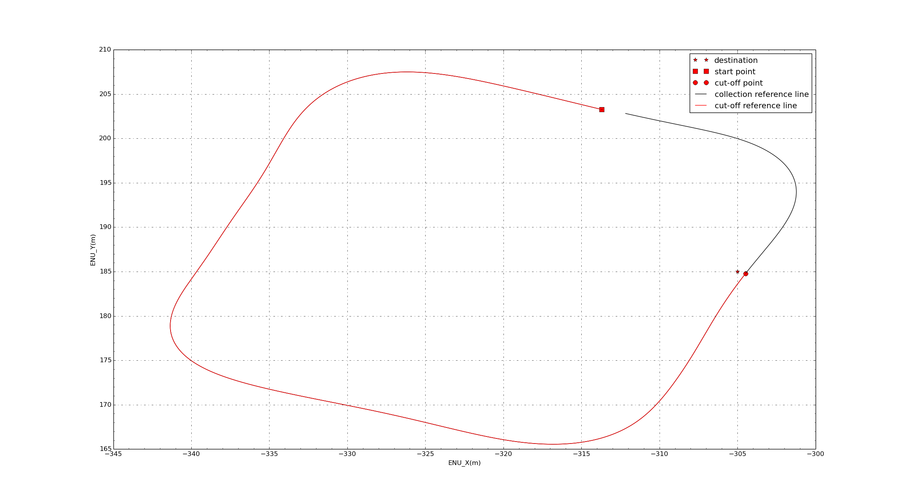
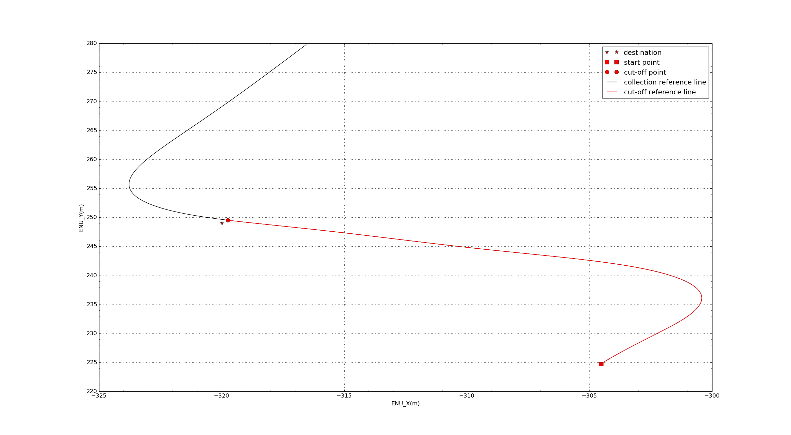

### 导航模式下到录制轨迹终点Planning停不下来

***
#### 遇到问题

1. apollo默认定位数据好像是不会丢失的，每次planning获取的定位都是队列中维护的最新的数据
   但是我们的GPS信号丢失，用的一直是丢失时的（队列中最新的）那次位置进行规划，更改之后如果出现这样的情况，就停止规划。
2. 之前停止规划时会一直执行规划前最后一次的控制指令，更改之后停止规划就紧急停车。
***

#### 修改部分
* /modules/planning/navi_planning.cc`

  >`FLAGS_publish_estop`在`/modules/planning/common/planning_gflags.cc`默认设置是`false`
  >
  >**代码为**：`DEFINE_bool(publish_estop, false, "publish estop decision in planning");`
  >
  >**这样会在规划不成功的时候生成`estop`（紧急刹车）指令**


  ```c++
        if (FLAGS_publish_estop) {//上面还有代码会判断规划是否成功
          AERROR << "Planning failed and set estop";
          // Because the function "Control::ProduceControlCommand()" checks the
          // "estop" signal with the following line (Line 170 in control.cc):
          // estop_ = estop_ || trajectory_.estop().is_estop();
          // we should add more information to ensure the estop being triggered.
          EStop* estop = trajectory_pb->mutable_estop();
          estop->set_is_estop(true);
          estop->set_reason(status.error_message());
        }
  ```

* `/modules/control/control.cc`

  >`FLAGS_enable_persistent_estop`在`/modules/control/common/control_gflags.cc`默认设置是`false`
  >
  >**代码为**：`DEFINE_bool(enable_persistent_estop, false, "True to persistent keep estop status, " "pad reset can reset the estop status.");`


  ```c++
    // check estop
    estop_ = FLAGS_enable_persistent_estop
                 ? estop_ || trajectory_.estop().is_estop()
                 : trajectory_.estop().is_estop();
  ```

***

**主要原因：**

* 在路测中[参考线跑完仍会继续行驶](https://github.com/ApolloAuto/apollo/issues/5805)，到达终点后需要人工接管。目前相对地图的逻辑是 完成指引线后，会继续延实时车道线自动驾驶。

  也就是即使未发送参考线，也会有相对地图产生，默认车头方向生成一定距离的笔直车道，这也是抵达参考线终点会
  继续使用这种情况下产生的地图而不会停下来。要解决的问题是不发送参考线的时候就不应该产生相对地图。

***

* `/modules/control/control.cc`
  * 规划部分决策出`not_ready`（这种情况一般是`localization`丢失）的信息，也需要刹车
  * **导航规划部分快接近参考线终点时会产生`STOP_REASON_DESTINATION`的信息，是否要考虑加入停车判断当中？**


```c++
  if (estop_) {// 此处添加 || trajectory_.decision().main_decision().has_not_ready()
    AWARN_EVERY(100) << "Estop triggered! No control core method executed!";
    // set Estop command
    control_command->set_speed(0);
    control_command->set_throttle(0);
    control_command->set_brake(control_conf_.soft_estop_brake());
    control_command->set_gear_location(Chassis::GEAR_DRIVE);
  }
```

***

* `/modules/map/relative_map/navigation_lane.cc`

  * 因为相对地图是由**参考线+感知**得到，由于没有感知的车道线，因此为了在**参考线**作用结束后，**感知**部分不起作用，将代码暂时修改，后面应该有**更好的策略**

    ```c++
      //ConvertLaneMarkerToPath()该函数通过感知得到的车道标记生成navigation path
      const double current_speed =
          VehicleStateProvider::instance()->vehicle_state().linear_velocity();
      double path_range = current_speed * FLAGS_ratio_navigation_lane_len_to_speed;
      if (path_range <= FLAGS_min_len_for_navigation_lane) {
        path_range = FLAGS_min_len_for_navigation_lane;
      } else {
        path_range = FLAGS_max_len_for_navigation_lane;
      }
      //加了 path_range = -3; 不让感知部分起作用
      const double unit_z = 1.0;
      const double start_s = -2.0;
      double accumulated_s = start_s;
      for (double z = start_s; z <= path_range; z += unit_z) {
          //...
      }
    ```

    

  * 如果不修改，导航模式下，一般在启动模块并且没有发送参考线的情况下，在`dreamview`上观察会生成两条笔直的白色车道线，就是由于感知会按照以下规则向前延伸生成，生成的长度参考`/modules/map/relative_map/commmon/relative_map_gflags.cc`中

    ```c++
    DEFINE_double(min_len_for_navigation_lane, 150.0,
                  "min generated navigation lane length");
    
    DEFINE_double(max_len_for_navigation_lane, 250.0,
                  "max generated navigation lane length");
    
    DEFINE_double(ratio_navigation_lane_len_to_speed, 8.0,
                  "navigation lane length to adv speed ratio");
    ```

***

### 使用路由还是参考线

* 路由是在标准导航模式下，其中需要接入高精度地图搜索指定路径

* 导航模式下，截取参考线发布到话题`/apollo/navigation`
  * 修改`/modules/tools/navigator/navigator.py`文件，该文件提供话题输入给相对地图模块
  * 目前思路如下：
    1. 录制可能行驶路线的轨迹
    
    2. [输入目的地点坐标](../images/cut-off-reference_line/navigator_routing.py)，匹配轨迹点上最近的点并截取作为发送参考线的终点
    
       **Usage:**`python navigator_routing.py [collection route] [ENU_X] [ENU_Y]`
    
    3. 可以把截取后的参考线可视化一下 
  
  
  
  