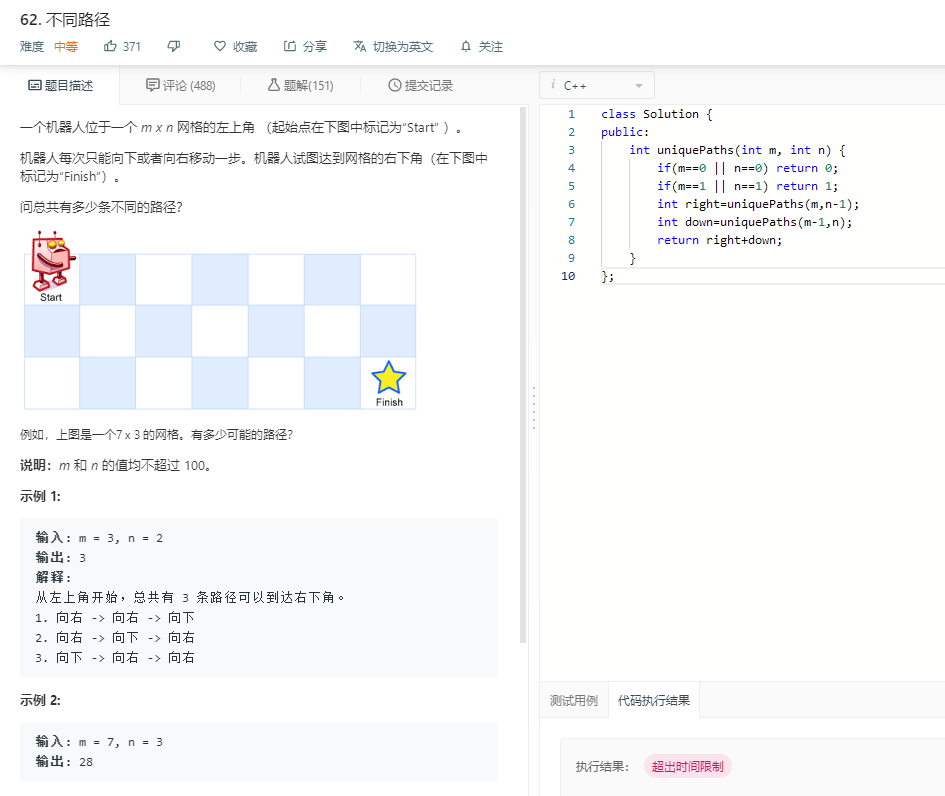
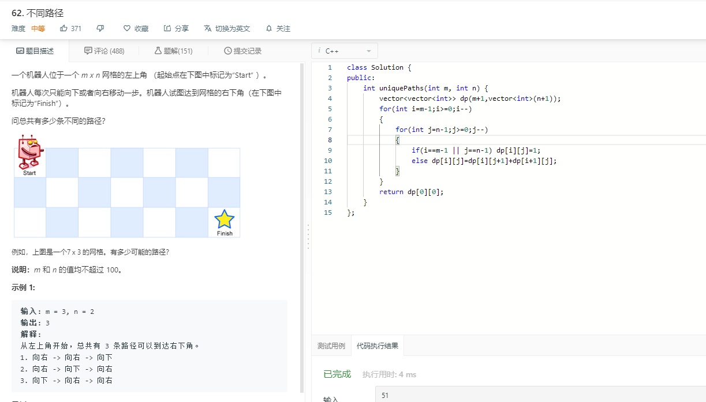

# 62.Unique Paths

***

**C++** 动态规划

****



如果单纯的使用递归会超时，而动态规划即**递归+记忆**，减少重复计算(空间换时间)



*****

思路是这样的：举个简单的例子：

1. 开辟二维dp数组用来存储每一个位置到终点的路径数: 
   * eg:`dp[m-1][n]=`1
2. 状态转移方程：
   * `dp[i][j]=dp[i][j+1]+dp[i+1][j]`每一个位置的路径数=右边路径数+下边路径数

***

代码如下：

```c++
class Solution {
public:
    int uniquePaths(int m, int n) {
        vector<vector<int>> dp(m+1,vector<int>(n+1));
        for(int i=m-1;i>=0;i--)
        {
            for(int j=n-1;j>=0;j--)
            {
                if(i==m-1 || j==n-1) dp[i][j]=1;
                else dp[i][j]=dp[i][j+1]+dp[i+1][j];
            }
        }
        return dp[0][0];
    }
};
```

****

